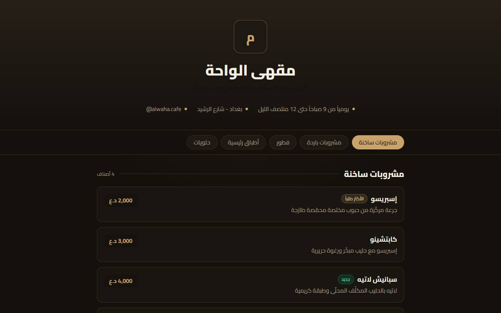
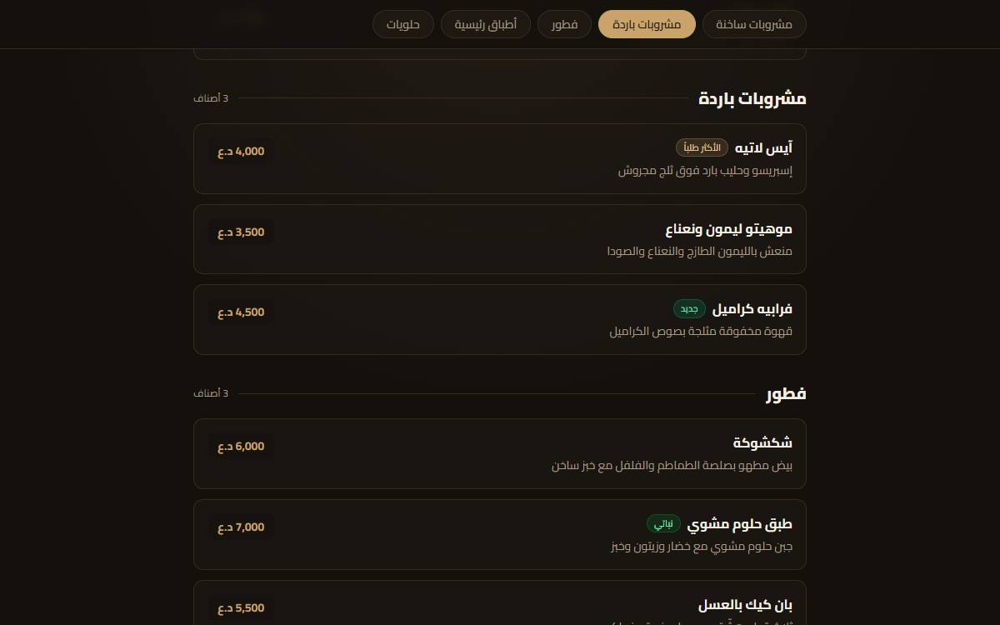
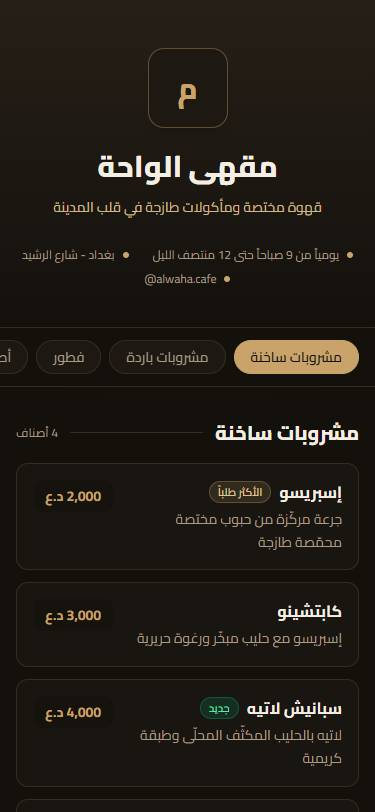

# Menyu — منيو رقمي للمطاعم والمقاهي

نظام منيو رقمي عربي (RTL) يعرض قائمة المطعم بتصميم عصري على هاتف الزبون عبر رمز QR.
بُني بـ Next.js و TypeScript و Tailwind CSS، وهو جاهز للنشر مباشرة على Vercel أو Netlify.

النص أدناه بالعربية، يليه ملخص بالإنجليزية.



## الفكرة

كثير من المطاعم والمقاهي تحتاج بديلاً عن المنيو الورقي: قائمة رقمية يفتحها الزبون بمسح
رمز QR على الطاولة، تُحدّث الأسعار والأصناف فيها فوراً دون إعادة طباعة. هذا المشروع يقدّم
ذلك بصفحة واحدة سريعة، عربية بالكامل، وسهلة التخصيص.

## المزايا

- واجهة عربية كاملة باتجاه RTL وخط Cairo.
- تصميم داكن فاخر متجاوب مع الجوال وسطح المكتب.
- شريط تصنيفات لاصق يتتبّع القسم الظاهر تلقائياً أثناء التمرير (scroll-spy).
- بطاقات أصناف مع وصف وسعر وشارات (الأكثر طلباً، جديد، نباتي، حار).
- صفحة رمز QR قابل للتنزيل والطباعة لوضعه على الطاولات.
- محتوى المنيو بالكامل يُدار من ملف بيانات واحد، دون لمس الكود.
- صفحات ثابتة (Static) لأداء عالٍ وزمن تحميل منخفض.

## لقطات

| سطح المكتب | الجوال |
| --- | --- |
|  |  |

## التقنيات

- Next.js 16 (App Router)
- React 19
- TypeScript
- Tailwind CSS v4
- qrcode لتوليد رمز QR

## التشغيل محلياً

```bash
npm install
npm run dev
```

ثم افتح http://localhost:3000

للبناء للإنتاج:

```bash
npm run build
npm run start
```

## تخصيص المنيو

كل المحتوى موجود في ملف واحد: `src/data/menu.ts`

- `restaurant`: اسم المطعم، الوصف، العملة، الهاتف، العنوان، أوقات الدوام.
- `categories`: التصنيفات وأصنافها مع الأسعار والأوصاف والشارات.

غيّر القيم في هذا الملف لتحصل على منيو مطعمك دون أي تعديل في الكود.

## النشر

المشروع متوافق مع Vercel و Netlify مباشرة. ارفع المستودع واربطه بالمنصّة، ثم
استخدم الرابط الناتج في صفحة `/qr` لطباعة رمز الطاولات.

## هيكل المشروع

```
src/
  app/
    layout.tsx       التخطيط العام، اتجاه RTL، الخط العربي
    page.tsx         صفحة المنيو الرئيسية
    qr/page.tsx      صفحة رمز QR القابل للتنزيل
    globals.css      الثيم وألوان الواجهة
  components/
    MenuHeader.tsx   ترويسة المطعم
    CategoryNav.tsx  شريط التصنيفات مع تتبّع القسم النشط
    MenuItemCard.tsx بطاقة الصنف
  data/menu.ts       بيانات المطعم والمنيو
  lib/format.ts      تنسيق الأسعار
```

---

## English summary

Menyu is an Arabic-first (RTL) digital menu for restaurants and cafes. Customers scan a
QR code at the table to open a fast, modern menu on their phone; prices and items update
instantly with no reprinting. Built with Next.js 16, React 19, TypeScript, and Tailwind
CSS v4, and statically rendered for high performance.

All menu content lives in a single data file (`src/data/menu.ts`), so the whole menu can be
customized without touching the code. The project deploys directly to Vercel or Netlify.

```bash
npm install
npm run dev
```

## الترخيص

MIT
